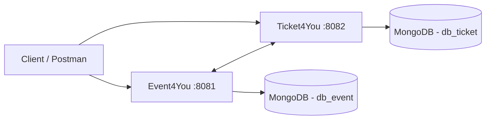

# Tickets4You

Backend application for **event and ticket management**, developed with Java and Spring Boot using a microservices architecture.

The project is composed of two independent services:

- **Event4You** — responsible for event management.
- **Ticket4You** — responsible for ticket management and association with existing events.

The services communicate through REST using **Spring Cloud OpenFeign** and use **MongoDB** for persistence.

---

## Architecture



The complete environment can be started using Docker Compose.

---

## Technologies

- Java 17
- Spring Boot 3.4.3
- Spring Web
- Spring Data MongoDB
- Spring Cloud OpenFeign
- MongoDB
- Docker
- Docker Compose
- Maven
- Lombok
- REST APIs

The project was also deployed to AWS EC2 during development.

The public EC2 environment is currently offline, but the complete application can be executed locally.

---

## Services

### Event4You

Responsible for creating, retrieving, updating and deleting events.

Local address:

```text
http://localhost:8081/api/events/v1
```

Main endpoints:

| Method | Endpoint | Description |
|---|---|---|
| GET | `/` | Returns all events |
| POST | `/create-event` | Creates an event |
| GET | `/{eventId}` | Returns an event by ID |
| PUT | `/{eventId}` | Updates an event |
| DELETE | `/delete-event/{eventId}` | Deletes an event |
| GET | `/sorted` | Returns events sorted alphabetically |

---

### Ticket4You

Responsible for creating and managing tickets associated with events.

Local address:

```text
http://localhost:8082/api/tickets/v1
```

Main endpoints:

| Method | Endpoint | Description |
|---|---|---|
| GET | `/` | Returns all tickets |
| POST | `/create-ticket` | Creates a ticket |
| GET | `/{ticketId}` | Returns a ticket by ID |
| GET | `/check-tickets/{eventId}` | Checks tickets associated with an event |
| DELETE | `/delete-ticket/{ticketId}` | Deletes a ticket |
| GET | `/get-ticket-by-cpf/{cpf}` | Returns tickets associated with a CPF |
| DELETE | `/delete-ticket-by-cpf/{cpf}` | Deletes tickets associated with a CPF |

---

## Running locally with Docker

### Requirements

- Docker
- Docker Compose
- Git

Clone the repository:

```bash
git clone https://github.com/Pichula07/Tickets4you.git
cd Tickets4you
```

Start the complete environment:

```bash
docker compose up --build
```

Docker Compose starts:

```text
Event4You   -> localhost:8081
Ticket4You  -> localhost:8082
MongoDB     -> localhost:27017
```

To stop the environment:

```bash
docker compose down
```

---

## Example — Creating an Event

```http
POST http://localhost:8081/api/events/v1/create-event
```

Example body:

```json
{
  "eventName": "Tech Conference",
  "dateTime": "2026-12-10T19:00:00",
  "zipCode": "99700000"
}
```

The application uses the provided postal code as part of the event address flow.

---

## Example — Creating a Ticket

```http
POST http://localhost:8082/api/tickets/v1/create-ticket
```

Example body:

```json
{
  "customerName": "João Pedro",
  "cpf": "00000000000",
  "customerEmail": "example@email.com",
  "eventId": "EVENT_ID",
  "brlAmount": "300.00",
  "usdAmount": "55.00"
}
```

The `eventId` must reference an existing event.

---

## What this project demonstrates

This project was developed to practice and demonstrate concepts such as:

- Microservices architecture
- REST API development
- Service-to-service communication
- Data persistence with MongoDB
- Separation of responsibilities
- Error handling
- Containerization
- Environment configuration
- Backend deployment
- Integration between independent applications

---

## Author

**João Pedro Murari**

Computer Science student focused on backend development, systems integration and problem-solving.
